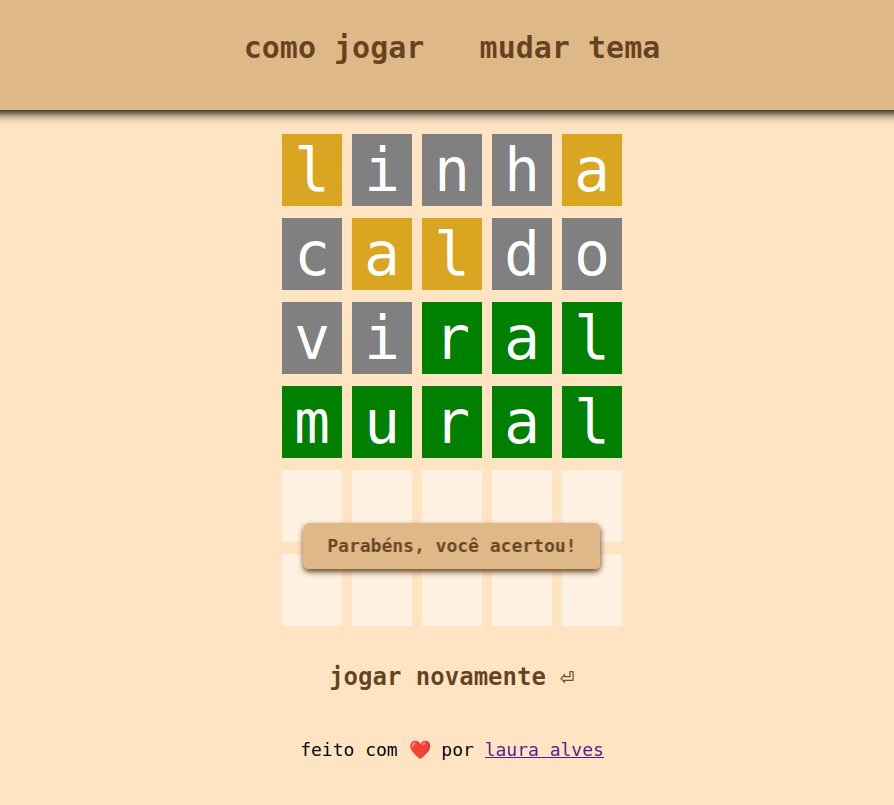

# Vocábulo 

Um jogo passatempo de adivinhar a palavra.

## 📸 Demonstração

Você pode jogar agora mesmo acessando o site:

**https://lauraonline.github.io/vocabulo**

## ✨ Funcionalidades

- **Lógica completa de adivinhação:** As letras são coloridas de verde (letra e posição corretas), amarelo (letra correta, posição errada) ou cinza (letra ausente).
- **Dicionário dinâmico:** O jogo sorteia uma palavra aleatória de um dicionário com centenas de palavras a cada nova partida.
- **Tema Escuro (Dark Mode):** Interface com um tema alternativo para melhor visualização em ambientes com pouca luz.
- **Opção para Jogar Novamente:** Ao final de cada partida (vitória ou derrota), o jogador pode iniciar um novo jogo com o clique de um botão.

## 🛠️ Tecnologias Utilizadas

O projeto foi construído utilizando as seguintes tecnologias:

- **HTML5:** Para a estrutura semântica do site.
- **CSS3:** Para a estilização, responsividade e o sistema de temas.
- **JavaScript (Vanilla):** Para toda a lógica do jogo e interatividade.
- **GitHub Pages:** Para a hospedagem e publicação do site.
